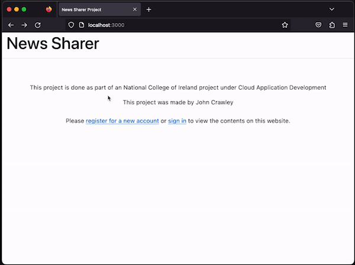
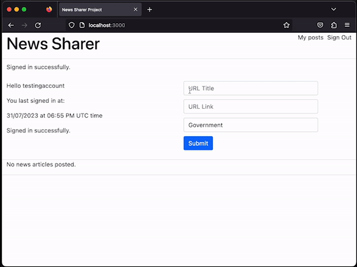
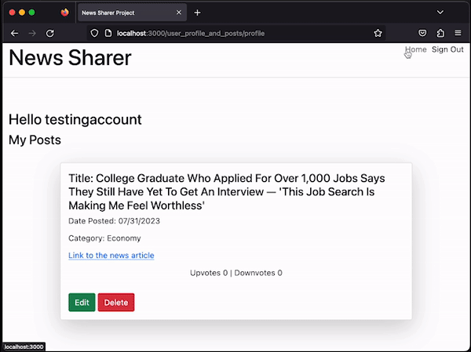
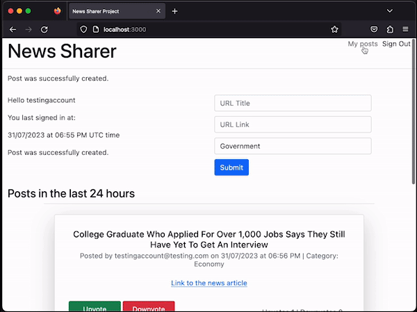

# News Sharer Project:
 Using Ruby on Rails technologies, I've created a project that people can share news articles on. People can upvote a post boosting it up to the top of the page

## List of GEMs:
* SQLlite3 - used for the project's database. 
[See SQLlite3 information page for latest version etc ](https://www.sqlite.org/index.html)

* Acts As Votable - a GEM to allow upvotes and downowvotes on posts. 
[See Acts_As_Votable Github page for more information on this GEM](https://github.com/ryanto/acts_as_votable)

* Devise - A GEM for user creation and user login
[See Devise Github page for more information on this GEM](https://github.com/heartcombo/devise)

[See Devise RubyGems.org page for GEM installation](https://rubygems.org/gems/devise/versions/4.9.2)

* Bootstrap 5.3 -  Bootstrap is a CSS framework to stylise the web pages
[See Bootstrap Github page for more information on this GEM](https://github.com/twbs/bootstrap-rubygem)

* Custom GEM - Custom GEM to sort the homepage feed where the more upvotes than vote gets bumped up to the top of the feed [See GEM](./lib/newsSharerCustomFeedGem/)

# Demostration 
## User Registeration 
This is a demostration of user creation working.  Therefore new news can be made and automatically 
logged in to post or view other posts. 

## User Login 
The user can also login if they are logged out or choose to logout. 

## News Post Creation 
Creating a new post is easy. You access the main homepage and add the data to the relative fields 
and post using, "submit 

## Post Organised By Upvotes 
By creating a new news post, I check that it's below the post with one upvote, this shows that posts with less upvotes will be pushed below other posts. 

## Post Edit
We can edit the post data, maybe the title is too long or the user selected the wrong category, we can edit any post by the user that is logged in. 

## Post Deletion 
If the user doesn't like the post they made, they can delete the post, however, currently you need to refresh to update the page on the post being deleted

## Important Information:

* Ruby version: 3.2.2 (2023-03-30 revision e51014f9c0)

* Database: SQLite version: 1.6.3

* System dependencies

* Configuration

* Database creation

* Database initialization

* How to run the test suite

* Services (job queues, cache servers, search engines, etc.)

* Deployment instructions

* 